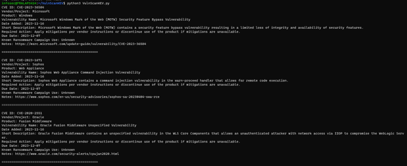
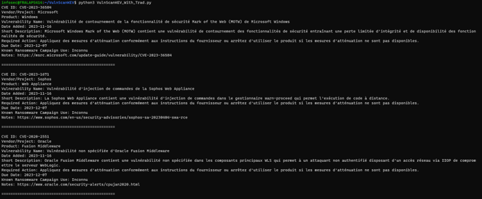
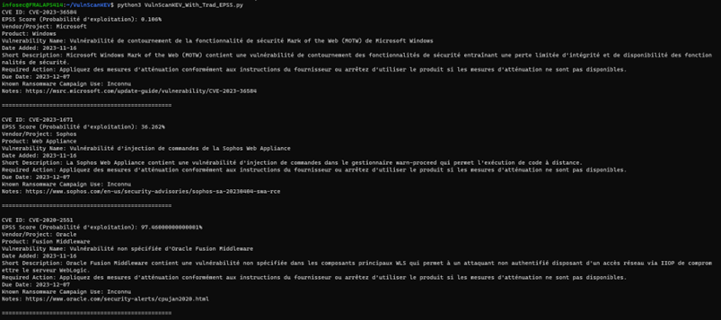
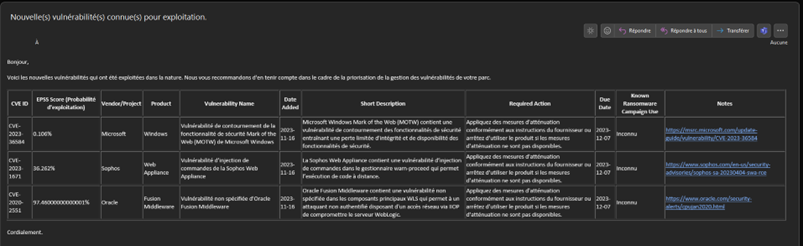

- [OBJECTIVE](#objective)
- [WHY ONLY THESE VULNERABILITIES?](#why-only-these-vulnerabilities)
  - [WHY CISA?](#why-cisa)
  - [DEFINING A KEV?](#defining-a-kev)
    - [CRITERIA](#criteria)
      - [1 - HAVE A CVE IDENTIFIER](#1---have-a-cve-identifier)
      - [2 - ACTIVELY EXPLOITED](#2---actively-exploited)
      - [3 - CLEAR CORRECTION GUIDELINES](#3---clear-correction-guidelines)
- [SCRIPT DESCRIPTIONS](#script-descriptions)
  - [CHOICE OF LANGUAGE](#choice-of-language)
  - [PREREQUISITES](#prerequisites)
    - [INTERNET ACCESS](#internet-access)
  - [AUTOMATIC TRANSLATION](#automatic-translation)
  - [THE SCRIPTS](#the-scripts)
    - [VulnScanKEV](#vulnscankev)
    - [VulnScanKEV\_With\_Trad](#vulnscankev_with_trad)
    - [VulnScanKEV\_With\_Trad\_EPSS](#vulnscankev_with_trad_epss)
    - [VulnScanKEV\_With\_Trad\_EPSS\_Mail](#vulnscankev_with_trad_epss_mail)
    - [VulnScanKEV\_With\_Trad\_EPSS\_Mail\_AUTO](#vulnscankev_with_trad_epss_mail_auto)
- [USING THE SCRIPT](#using-the-script)
  - [BACKUP](#backup)
- [DOCUMENTATION](#documentation)

# OBJECTIVE
This document aims to present scripts for managing vulnerabilities related to known weaknesses exploited by malicious actors.

# WHY ONLY THESE VULNERABILITIES?
In many information systems, it is inconceivable (for administrators) to successfully apply patches to the entire system. Therefore, it is necessary to adopt a risk-oriented approach. In this type of approach, knowing that a vulnerability in our system is actively exploited by attackers allows obtaining the human and technical resources needed to quickly fix this flaw.

## WHY CISA?
Unfortunately, in France, we lack high-quality feedback on such vulnerabilities. Therefore, I preferred to use an RSS feed from a reliable and recognized authority, even if it is American. Feel free to adapt the script to use another source.

## DEFINING A KEV?
_KEV (Known Exploited Vulnerabilities): Known and exploited vulnerabilities._

### CRITERIA
#### 1 - HAVE A CVE IDENTIFIER
The first criterion for adding a vulnerability to the KEV catalog is the assignment of a CVE identifier. The CVE identifier, also called CVE record, CVE name, CVE number, is a unique and common identifier for a cybersecurity vulnerability known to the public.

#### 2 - ACTIVELY EXPLOITED
A vulnerability actively exploited is one for which there is reliable evidence that the execution of malicious code has been carried out by an actor on a system without the owner's authorization.

Events that do not constitute active exploitation, concerning the KEV catalog, include:
* Scanning
* Security exploit search
* Proof of concept (PoC)

#### 3 - CLEAR CORRECTION GUIDELINES
CISA adds known exploited vulnerabilities to the catalog when there is a clear action for the concerned organization to take. Measures may include updating, implementing mitigation measures, or deploying workarounds.

# SCRIPT DESCRIPTIONS
## CHOICE OF LANGUAGE
To ensure compatibility with a maximum of operating systems, Python 3 has been chosen.

## PREREQUISITES
```pip install -r requirements.txt```

### INTERNET ACCESS
For translation, I use Google Translate, so internet access is required for this part.

## AUTOMATIC TRANSLATION
The language to translate into is defined in line 10. Please modify the 'target' part.

Example:
```translator = GoogleTranslator(source='en', target='fr')```

## THE SCRIPTS
### VulnScanKEV 
Displays information about KEVs from the previous day.



### VulnScanKEV_With_Trad
Adds French translation (language can be modified as needed).



### VulnScanKEV_With_Trad_EPSS
Adds the probability of vulnerability exploitation score.



### VulnScanKEV_With_Trad_EPSS_Mail
Removes information display and adds the generation of an .eml file containing the information.



### VulnScanKEV_With_Trad_EPSS_Mail_AUTO
Removes file generation and adds automatic email sending.

# USING THE SCRIPT
Run the script once a day via a scheduled task/cron.

## BACKUP
In case you are concerned that the script may stop working, you have the option to subscribe to email alerts to receive automatic notifications when new CVEs are added to this catalog. If you receive the CISA email but not the scheduled task one, you know there is an issue.

[Subscribe to the KEV Catalog Updates](https://public.govdelivery.com/accounts/USDHSCISA/subscriber/new?topic_id=USDHSCISA_136)

# DOCUMENTATION
[KEV Catalog](https://www.cisa.gov/known-exploited-vulnerabilities-catalog)
[Definition of a KEV](https://www.cisa.gov/known-exploited-vulnerabilities)
[JSON Schema of a KEV](https://www.cisa.gov/sites/default/files/feeds/known_exploited_vulnerabilities_schema.json)
