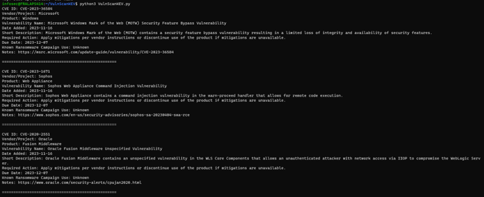
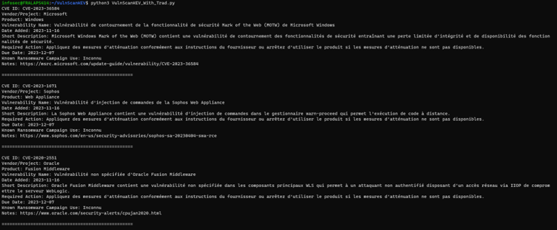
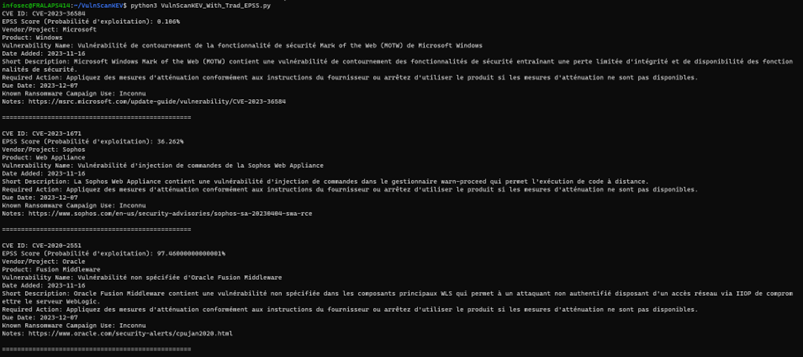
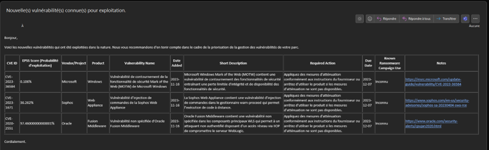

- [OBJET](#objet)
- [POURQUOI UNIQUEMENT CES VULNERABILITES ?](#pourquoi-uniquement-ces-vulnerabilites-)
  - [POURQUOI LE CISA ?](#pourquoi-le-cisa-)
  - [DEFINIR UNE KEV ?](#definir-une-kev-)
    - [CRITERES](#criteres)
      - [1 - AVOIR UN IDENTIFIANT CVE](#1---avoir-un-identifiant-cve)
      - [2 - ETRE ACTIVEMENT EXPLOITEE](#2---etre-activement-exploitee)
      - [3 - DIRECTIVES CLAIRES EN MATIERE DE CORRECTION](#3---directives-claires-en-matiere-de-correction)
- [DESCRIPTION DES SCRIPTS](#description-des-scripts)
  - [CHOIX DU LANGUAGE](#choix-du-language)
  - [PREREQUIS](#prerequis)
    - [ACCES INTERNET](#acces-internet)
  - [TRADUCTION AUTOMATIQUE](#traduction-automatique)
  - [LES SCRIPTS](#les-scripts)
    - [VulnScanKEV](#vulnscankev)
    - [VulnScanKEV\_With\_Trad](#vulnscankev_with_trad)
    - [VulnScanKEV\_With\_Trad\_EPSS](#vulnscankev_with_trad_epss)
    - [VulnScanKEV\_With\_Trad\_EPSS\_Mail](#vulnscankev_with_trad_epss_mail)
    - [VulnScanKEV\_With\_Trad\_EPSS\_Mail\_AUTO](#vulnscankev_with_trad_epss_mail_auto)
- [UTILISATION DU SCRIPT](#utilisation-du-script)
  - [SECOURS](#secours)
- [DOCUMENTATIONS](#documentations)

# OBJET
Le présent document a pour objectif de présenter les scripts de gestion des vulnérabilités liées à des failles connues pour être exploitées par des acteurs malveillants.
# POURQUOI UNIQUEMENT CES VULNERABILITES ?
Dans de nombreux systèmes d'information, il est inconcevable (pour les responsables) de réussir à appliquer des correctifs à l'ensemble du parc. Il est donc nécessaire de s'orienter vers une approche axée sur le risque. Dans ce type d'approche, le fait de savoir qu'une vulnérabilité de notre parc est activement exploitée par des attaquants permet d'obtenir les moyens humains et techniques nécessaires pour corriger cette faille rapidement.
## POURQUOI LE CISA ?
Malheureusement, en France, nous manquons de retours de qualité sur ce type de vulnérabilités. J'ai donc préféré utiliser un flux RSS provenant d'une autorité fiable et reconnue, même si elle est américaine. Libre à vous d'adapter le script pour utiliser une autre source.
## DEFINIR UNE KEV ?
_KEV (Known Exploited Vulnerabilities) : Vulnérabilités connues et exploitées._
### CRITERES
#### 1 - AVOIR UN IDENTIFIANT CVE
Le premier critère d'ajout d'une vulnérabilité au catalogue KEV est l'attribution d'un identifiant CVE. L'identifiant CVE, également appelé enregistrement CVE, nom CVE, numéro CVE, est un identifiant unique et commun pour une vulnérabilité de cybersécurité connue du public.
#### 2 - ETRE ACTIVEMENT EXPLOITEE
Une vulnérabilité faisant l'objet d'une exploitation active est une vulnérabilité pour laquelle il existe des preuves fiables que l'exécution d'un code malveillant a été effectuée par un acteur sur un système sans l'autorisation du propriétaire du système.

Les événements qui ne constituent pas une exploitation active, en ce qui concerne le catalogue KEV, sont les suivants :
* Le balayage (scan)
* La recherche de sécurité d'un exploit
* La preuve de concept (PoC)
#### 3 - DIRECTIVES CLAIRES EN MATIERE DE CORRECTION
La CISA ajoute les vulnérabilités exploitées connues au catalogue lorsqu'il existe une action claire à prendre par l'organisation concernée. Les mesures peuvent inclure la mise à jour, la mise en place de mesures d'atténuation ou la mise en place de solutions de contournement.
# DESCRIPTION DES SCRIPTS
## CHOIX DU LANGUAGE
Afin d'assurer la compatibilité avec un maximum de systèmes d'exploitation, Python 3 a été choisi.
## PREREQUIS
```pip install -r requirements.txt```
### ACCES INTERNET
Pour la traduction, j'utilise Google Trad, il faudra donc avoir accès à internet pour cette partie.
## TRADUCTION AUTOMATIQUE
La langue vers laquelle effectuer la traduction est définie à la ligne 10. Veuillez modifier la partie 'target'.

Exemple : 
```    translator = GoogleTranslator(source='en', target='fr')```
## LES SCRIPTS
### VulnScanKEV 
Affiche les informations des KEV datant de la veille.


### VulnScanKEV_With_Trad
Ajoute la traduction en français (langue modifiable au besoin).


### VulnScanKEV_With_Trad_EPSS
Ajoute le score de probabilité d’exploitation de la vulnérabilité.


### VulnScanKEV_With_Trad_EPSS_Mail
Supprime l’affichage des informations et ajoute la génération d’un fichier .eml contenant les informations.



### VulnScanKEV_With_Trad_EPSS_Mail_AUTO
Supprime la génération du fichier et ajoute l’envoi automatique du mail.

# UTILISATION DU SCRIPT
Exécuter le script une fois par jour via une tâches planifiée/cron .

## SECOURS
Dans le cas où vous craignez que le script cesse de fonctionner, vous avez la possibilité de vous inscrire aux alertes par e-mail afin de recevoir une notification automatique lors de l'ajout de nouvelles CVE à ce catalogue.
Si vous recevez l'e-mail de la CISA mais pas celui de votre tâche planifiée, vous savez qu'il y a un problème.
[Subscribe to the KEV Catalog Updates](https://public.govdelivery.com/accounts/USDHSCISA/subscriber/new?topic_id=USDHSCISA_136)

# DOCUMENTATIONS
[Catalogue KEV](https://www.cisa.gov/known-exploited-vulnerabilities-catalog)
[Definition d'une KEV](https://www.cisa.gov/known-exploited-vulnerabilities)
[Schema JSON d'une KEV](https://www.cisa.gov/sites/default/files/feeds/known_exploited_vulnerabilities_schema.json)